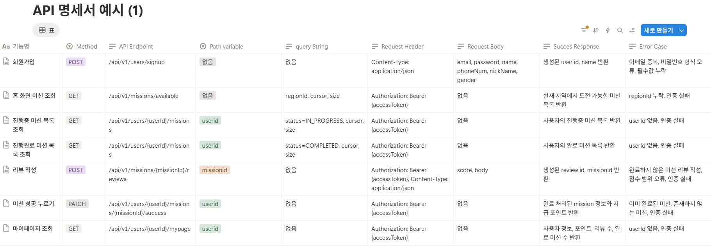

# 3주차 미션 - API 명세서 정리

이번 미션에서는 1주차 IA/WF를 기준으로, 서비스에 필요한 API를 먼저 설계하고 간단한 API 명세서 형태로 정리했다.  
이번 주차에서는 실제 구현보다도, 어떤 Endpoint가 필요하고 어떤 요청과 응답 형식으로 프론트와 데이터를 주고받을지를 먼저 정리하는 것이 중요하다고 생각했다.

## 1. 공통 응답 형식

응답 형식은 최대한 통일해서 아래와 같이 구성했다.

### 성공 응답
```json
{
  "success": true,
  "code": "S200",
  "message": "요청이 성공했습니다.",
  "data": {}
}
```

### 실패 응답
```json
{
  "success": false,
  "code": "E4000",
  "message": "에러가 발생했습니다.",
  "data": null
}
```

## 2. API 명세서



## 3. API별 상세 명세
### 3-1. 회원가입

### Endpoint
```text
POST /api/v1/users/signup
```

### Request Header
```text
Content-Type: application/json
```

### Request Body
```json
{
  "email": "test@example.com",
  "password": "1234abcd!",
  "name": "김찬혁",
  "phoneNum": "010-1234-5678",
  "nickName": "찬찬",
  "gender": "M"
}
```
### Success Response
```json
{
  "success": true,
  "code": "S200",
  "message": "회원가입이 완료되었습니다.",
  "data": {
    "id": 1,
    "name": "김찬혁"
  }
}
```

### Error Case
```json
{
  "success": false,
  "code": "E4001",
  "message": "이미 존재하는 이메일입니다.",
  "data": null
}
```
```json
{
  "success": false,
  "code": "E4002",
  "message": "비밀번호 형식이 올바르지 않습니다.",
  "data": null
}
```

### 3-2. 홈 화면 미션 조회
### Endpoint
```text
GET /api/v1/missions/available
```

### Query String

- regionId : 현재 선택한 지역 ID
- cursor : 마지막으로 조회한 mission ID
- size : 한 번에 가져올 개수

예시
```text
GET /api/v1/missions/available?regionId=1&cursor=20&size=10
```

### Request Header
```text
Authorization: Bearer {accessToken}
```

### Success Response
```json
{
  "success": true,
  "code": "S200",
  "message": "도전 가능한 미션 목록 조회에 성공했습니다.",
  "data": {
    "missions": [
      {
        "missionId": 3,
        "title": "카페 음료 주문하기",
        "description": "카페에서 음료를 주문하기",
        "rewardPoint": 400,
        "storeName": "인천 카페",
        "daysLeft": 5
      }
    ],
    "nextCursor": 3,
    "hasNext": true
  }
}
```


### Error Case
```json
{
  "success": false,
  "code": "E4003",
  "message": "regionId가 필요합니다.",
  "data": null
}
```

### 3-3. 진행중 미션 목록 조회
### Endpoint
```text
GET /api/v1/users/{userId}/missions
```

### Path Variable
- userId

### Query String
- status=IN_PROGRESS
- cursor
- size

### 예시
```text
GET /api/v1/users/1/missions?status=IN_PROGRESS&cursor=10&size=10
```

### Request Header
```text
Authorization: Bearer {accessToken}
```
### Success Response
```json
{
  "success": true,
  "code": "S200",
  "message": "진행중 미션 목록 조회에 성공했습니다.",
  "data": {
    "missions": [
      {
        "userMissionId": 1,
        "missionId": 1,
        "title": "떡볶이집 방문하기",
        "rewardPoint": 500,
        "storeName": "인천 떡볶이집",
        "startedAt": "2026-04-01T12:00:00"
      }
    ],
    "nextCursor": 1,
    "hasNext": false
  }
}
```

### Error Case
```json
{
  "success": false,
  "code": "E4010",
  "message": "인증이 필요합니다.",
  "data": null
}
```

### 3-4. 진행완료 미션 목록 조회

### Endpoint
```text
GET /api/v1/users/{userId}/missions
```

### Path Variable
- userId
- Query String
- status=COMPLETED
- cursor
- size

### 예시
```text
GET /api/v1/users/1/missions?status=COMPLETED&cursor=10&size=10
```

### Request Header
```text
Authorization: Bearer {accessToken}
```

### Success Response
```json
{
  "success": true,
  "code": "S200",
  "message": "완료 미션 목록 조회에 성공했습니다.",
  "data": {
    "missions": [
      {
        "userMissionId": 2,
        "missionId": 2,
        "title": "떡볶이집 리뷰 작성하기",
        "rewardPoint": 300,
        "storeName": "인천 떡볶이집",
        "completedAt": "2026-04-01T13:00:00"
      }
    ],
    "nextCursor": 2,
    "hasNext": false
  }
}
```

### 3-5. 리뷰 작성
Endpoint
```text
POST /api/v1/missions/{missionId}/reviews
```

### Path Variable
- missionId
- Request Header
- Authorization: Bearer {accessToken}
- Content-Type: application/json

### Request Body
```json
{
  "score": 5,
  "body": "미션 수행이 재미있었습니다."
}
```

### Success Response
```json
{
  "success": true,
  "code": "S201",
  "message": "리뷰 작성이 완료되었습니다.",
  "data": {
    "reviewId": 1,
    "missionId": 2,
    "score": 5,
    "body": "미션 수행이 재미있었습니다."
  }
}
```

### Error Case
```json
{
  "success": false,
  "code": "E4004",
  "message": "완료한 미션에만 리뷰를 작성할 수 있습니다.",
  "data": null
}
```

### 3-6. 마이페이지 조회
### Endpoint
```text
GET /api/v1/users/{userId}/mypage
```

### Path Variable
- userId
- Request Header
- Authorization: Bearer {accessToken}

### Success Response
```json
{
  "success": true,
  "code": "S200",
  "message": "마이페이지 조회에 성공했습니다.",
  "data": {
    "id": 1,
    "name": "김찬혁",
    "nickName": "찬찬",
    "phoneNum": "010-1234-5678",
    "point": 1000,
    "reviewCount": 3,
    "completedMissionCount": 5
  }
}
```

### 3-7. 미션 성공 누르기
### Endpoint
```text
PATCH /api/v1/users/{userId}/missions/{missionId}/success
```

### Path Variable
- userId
- missionId

### Request Header
```text
Authorization: Bearer {accessToken}
```

### Request Body

없음

### Success Response
```json
{
  "success": true,
  "code": "S200",
  "message": "미션이 성공 처리되었습니다.",
  "data": {
    "missionId": 1,
    "status": "COMPLETED",
    "rewardPoint": 500,
    "currentPoint": 1500
  }
}
```

### Error Case
```json
{
  "success": false,
  "code": "E4005",
  "message": "이미 완료된 미션입니다.",
  "data": null
}
```
```json
{
  "success": false,
  "code": "E4040",
  "message": "존재하지 않는 미션입니다.",
  "data": null
}
```
