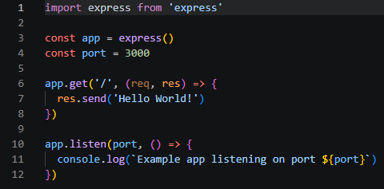
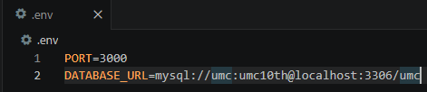

## 1. JavaScript 기초 복습

먼저 자바스크립트 기초 문법을 다시 확인했다.

### 복습한 내용

- `let`, `const`, `var` 차이
- 화살표 함수
- 구조분해할당
- `async / await`

---

## 2. Node.js 핵심 개념 정리

이번 주차에서 가장 먼저 다시 정리한 개념은 Node.js가 무엇인지였다

### 이해한 내용

- Node.js는 서버 자체가 아니라 JavaScript 런타임이다.
- 즉, 브라우저 밖에서도 JavaScript를 실행할 수 있게 해주는 환경이다.
- Node.js는 싱글 스레드 기반이지만, 논블로킹 I/O와 이벤트 루프 구조 덕분에 많은 요청을 효율적으로 처리할 수 있다.
- 파일 시스템, 네트워크, 데이터베이스처럼 I/O 중심 작업에 강점이 있다

### 느낀 점

이전에는 Node.js를 그냥 백엔드 도구 정도로만 생각했는데, 이번에 다시 보면서 “브라우저 밖에서 JavaScript를 실행하는 런타임”이라는 정의가 더 정확하다는 걸 이해하게 되었다.

---

## 3. ES6와 ES Module 정리

### 정리한 내용

- ES6는 JavaScript 문법에 큰 변화를 가져온 버전이다.
- Node.js에서는 CommonJS 방식과 ES Module 방식을 사용할 수 있다.
- ES Module에서는 `import`, `export` 문법을 사용한다.
- 이를 사용하기 위해 `package.json`에 `"type": "module"` 설정이 필요하다.

### 느낀 점

지난 주차에 그냥 설정처럼 넣었던 `"type": "module"`이 왜 필요한지 이번에 더 명확하게 이해할 수 있었다.

단순히 문법 차이가 아니라, 최신 JavaScript/TypeScript 환경에서 더 자연스럽게 사용하는 모듈 방식이라는 점이 인상적이었다.

---

## 4. TypeScript 기초 학습

이번 주차에서는 다음 챕터부터 TypeScript를 사용하기 때문에, 기본 개념도 미리 정리했다.

### 학습한 내용

- TypeScript는 JavaScript의 슈퍼셋이다.
- 컴파일 단계에서 타입 검사를 통해 오류를 미리 발견할 수 있다.
- 기본 타입: `string`, `number`, `boolean`, `any`, `unknown`, `never`
- 객체 타입, 배열 타입, 유니언 타입
- 함수 타입
- 제너릭
- `type`, `interface`

### 느낀 점

TypeScript는 문법이 많아서 복잡하게 느껴질 수 있지만, 결국 큰 프로젝트에서 안정성을 높이고 유지보수를 쉽게 하기 위한 도구라는 점이 더 중요하다고 느꼈다.

특히 JavaScript의 암묵적 타입 변환 문제를 미리 막아줄 수 있다는 점이 인상적이었다.

---

## 5. 프로젝트 파일 구조 정리

이번 주차에서는 프로젝트 구조도 같이 정리했다.

### 이해한 구조

- `src`
- `modules/users`
- `controllers`
- `services`
- `repositories`
- `dtos`

### 각 계층 역할

- **Controller**: 요청을 받고 응답을 반환
- **Service**: 비즈니스 로직 처리
- **Repository**: DB 접근 담당
- **DTO**: 계층 간 데이터 전달 및 유효성 검증에 활용

### 느낀 점

처음에는 폴더를 나누는 게 단순히 정리 목적이라고 생각했지만, 실제로는 유지보수성과 협업 효율을 높이기 위한 구조라는 걸 느꼈다.

특히 서비스 로직과 DB 접근을 분리하는 것이 중요하다고 생각했다.

---

## 6. 환경 변수와 보안

이번 주차에서는 `.env` 파일과 `.gitignore` 설정도 같이 확인했다.

### 정리한 내용

- 포트 번호, DB 주소, API 키 같은 민감한 정보는 `.env`에 저장
- `.gitignore`에 `.env`를 포함해서 깃에 올라가지 않도록 관리

### 느낀 점

환경 변수 관리는 단순 설정이 아니라 보안과 직결된 부분이라고 느꼈다.

특히 실수로 깃에 올리지 않도록 `.gitignore`를 미리 잘 설정하는 게 중요하다고 생각했다