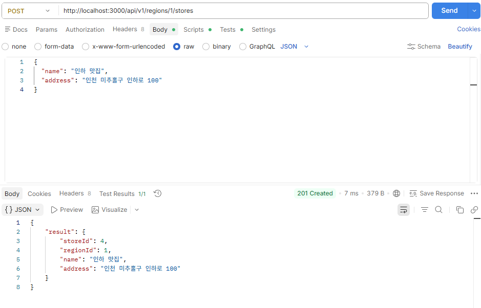
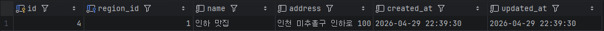
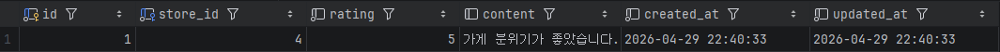
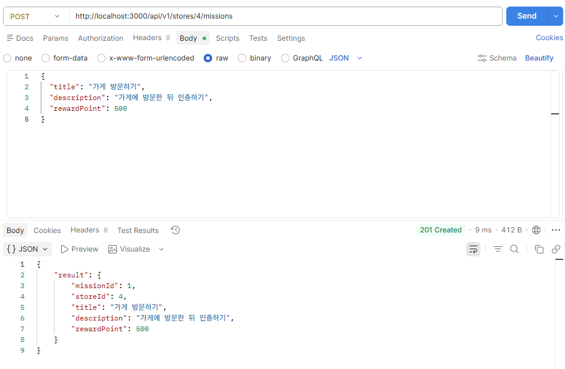
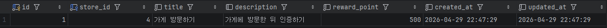
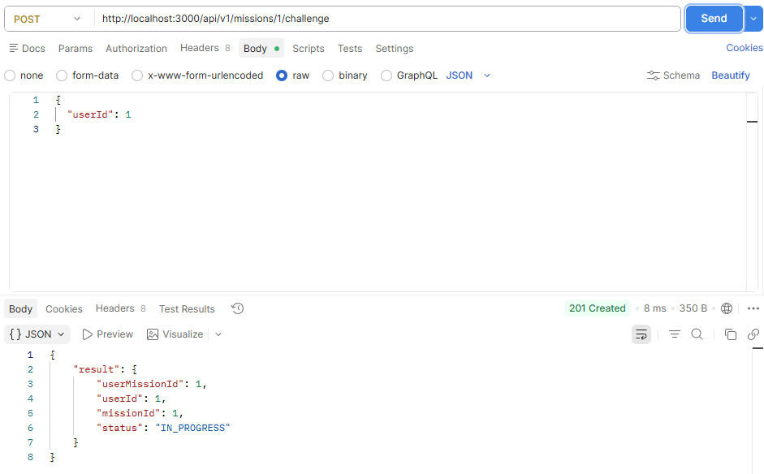
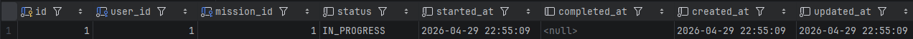
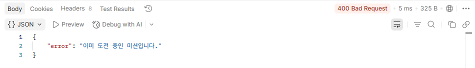
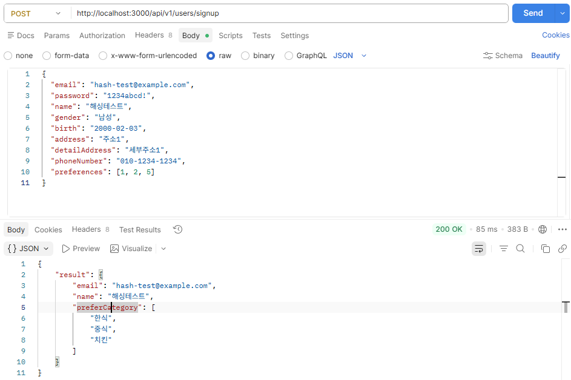
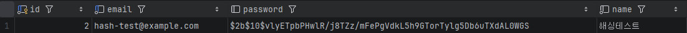

## 0. GitHub 정보

### 작업 브랜치

```text
feature/chapter-05
````

### GitHub 링크

```text
여기에 본인 GitHub PR 또는 Repository 링크 첨부
```

> main 브랜치가 아닌 `feature/chapter-05` 브랜치에서 작업했다.

---

## 1. 구현한 API 목록

| 번호  | API            | Method | Endpoint                                |
| --- | -------------- | ------ | --------------------------------------- |
| 1-1 | 특정 지역에 가게 추가하기 | POST   | `/api/v1/regions/:regionId/stores`      |
| 1-2 | 가게에 리뷰 추가하기    | POST   | `/api/v1/stores/:storeId/reviews`       |
| 1-3 | 가게에 미션 추가하기    | POST   | `/api/v1/stores/:storeId/missions`      |
| 1-4 | 미션 도전하기        | POST   | `/api/v1/missions/:missionId/challenge` |

---

## 2. 1-1. 특정 지역에 가게 추가하기 API

### 핵심 내용

특정 지역에 새로운 가게를 추가하는 API이다.
`regionId`를 Path Variable로 받아 해당 지역에 가게를 등록한다.

### Request

```text
POST /api/v1/regions/1/stores
```

### Body

```json
{
  "name": "인하 맛집",
  "address": "인천 미추홀구 인하로 100"
}
```

### 핵심 코드

```ts
app.post("/api/v1/regions/:regionId/stores", handleCreateStore);
```

```ts
const regionId = Number(req.params.regionId);
const store = await createStore(bodyToStore(req.body, regionId));
```

### 사진 첨부





### 확인한 내용

* Postman으로 가게 추가 요청 성공
* `stores` 테이블에 데이터 저장 확인

---

## 3. 1-2. 가게에 리뷰 추가하기 API

### 핵심 내용

특정 가게에 리뷰를 추가하는 API이다.
리뷰를 추가하려는 가게가 실제로 존재하는지 검증한 뒤 리뷰를 저장한다.

### Request

```text
POST /api/v1/stores/1/reviews
```

### Body

```json
{
  "rating": 5,
  "content": "가게 분위기가 좋았습니다."
}
```

### 핵심 코드

```ts
app.post("/api/v1/stores/:storeId/reviews", handleCreateReview);
```

```ts
const store = await findStoreById(data.storeId);

if (!store) {
  throw new Error("존재하지 않는 가게입니다.");
}
```

### 사진 첨부




### 확인한 내용

* 존재하는 가게에 리뷰 추가 성공
* 존재하지 않는 가게에 요청했을 때 오류 반환 확인
* `reviews` 테이블에 데이터 저장 확인

---

## 4. 1-3. 가게에 미션 추가하기 API

### 핵심 내용

특정 가게에 미션을 추가하는 API이다.
미션을 추가하려는 가게가 존재하는지 확인한 뒤 미션을 저장한다.

### Request

```text
POST /api/v1/stores/1/missions
```

### Body

```json
{
  "title": "가게 방문하기",
  "description": "가게에 방문한 뒤 인증하기",
  "rewardPoint": 500
}
```

### 핵심 코드

```ts
app.post("/api/v1/stores/:storeId/missions", handleCreateMission);
```

```ts
const store = await findStoreById(data.storeId);

if (!store) {
  throw new Error("존재하지 않는 가게입니다.");
}
```

### 사진 첨부





### 확인한 내용

* 존재하는 가게에 미션 추가 성공
* `missions` 테이블에 데이터 저장 확인

---

## 5. 1-4. 미션 도전하기 API

### 핵심 내용

사용자가 특정 미션을 도전 중인 미션에 추가하는 API이다.
도전하려는 미션이 존재하는지 확인하고, 이미 도전 중인 미션인지 검증한 뒤 저장한다.

### Request

```text
POST /api/v1/missions/1/challenge
```

### Body

```json
{
  "userId": 1
}
```

### 핵심 코드

```ts
app.post("/api/v1/missions/:missionId/challenge", handleChallengeMission);
```

```ts
const alreadyChallenged = await findUserMission(data.userId, data.missionId);

if (alreadyChallenged) {
  throw new Error("이미 도전 중인 미션입니다.");
}
```

### 사진 첨부







### 확인한 내용

* 존재하는 미션에 도전 성공
* 이미 도전 중인 미션에 다시 도전했을 때 오류 반환 확인
* `user_missions` 테이블에 데이터 저장 확인

---

## 6. Controller → Service → Repository → DB 요청 흐름

이번 미션에서는 모든 API가 공통적으로 아래 흐름으로 처리되도록 구현했다.

```text
Client(Postman)
→ Express Router
→ Controller
→ DTO
→ Service
→ Repository
→ DB
→ Repository
→ Service
→ Controller
→ Response
````

---

### 6-1. 특정 지역에 가게 추가하기 API

```text
POST /api/v1/regions/1/stores 요청
→ handleCreateStore Controller 실행
→ regionId와 request body 확인
→ bodyToStore DTO로 요청 데이터 정리
→ createStore Service 호출
→ findRegionById로 지역 존재 여부 확인
→ addStore로 stores 테이블에 가게 저장
→ findStoreById로 저장된 가게 조회
→ responseFromStore로 응답 데이터 정리
→ JSON 응답 반환
```

이 API에서는 먼저 `regionId`에 해당하는 지역이 실제로 존재하는지 확인한 뒤, 존재할 경우에만 가게를 추가하도록 처리했다.

---

### 6-2. 가게에 리뷰 추가하기 API

```text
POST /api/v1/stores/1/reviews 요청
→ handleCreateReview Controller 실행
→ storeId와 request body 확인
→ bodyToReview DTO로 요청 데이터 정리
→ createReview Service 호출
→ findStoreById로 가게 존재 여부 확인
→ rating 값이 1점부터 5점 사이인지 확인
→ addReview로 reviews 테이블에 리뷰 저장
→ findReviewById로 저장된 리뷰 조회
→ responseFromReview로 응답 데이터 정리
→ JSON 응답 반환
```

이 API에서는 리뷰를 추가하려는 가게가 존재하는지 먼저 검증했다.
또한 평점이 잘못된 값으로 들어오는 것을 막기 위해 `rating` 범위도 함께 확인했다.

---

### 6-3. 가게에 미션 추가하기 API

```text
POST /api/v1/stores/1/missions 요청
→ handleCreateMission Controller 실행
→ storeId와 request body 확인
→ bodyToMission DTO로 요청 데이터 정리
→ createMission Service 호출
→ findStoreById로 가게 존재 여부 확인
→ rewardPoint가 0 이상인지 확인
→ addMission으로 missions 테이블에 미션 저장
→ findMissionById로 저장된 미션 조회
→ responseFromMission으로 응답 데이터 정리
→ JSON 응답 반환
```

이 API에서는 미션을 추가하려는 가게가 실제로 존재하는지 확인한 뒤 미션을 저장했다.

---

### 6-4. 미션 도전하기 API

```text
POST /api/v1/missions/1/challenge 요청
→ handleChallengeMission Controller 실행
→ missionId와 userId 확인
→ bodyToMissionChallenge DTO로 요청 데이터 정리
→ challengeMission Service 호출
→ findUserById로 사용자 존재 여부 확인
→ findMissionById로 미션 존재 여부 확인
→ findUserMission으로 이미 도전 중인지 확인
→ addUserMission으로 user_missions 테이블에 저장
→ findUserMissionById로 저장된 도전 미션 조회
→ responseFromUserMission으로 응답 데이터 정리
→ JSON 응답 반환
```

- 이 API에서는 도전하려는 미션이 존재하는지 확인했고, 사용자가 이미 같은 미션에 도전 중인지도 검증했다.
이미 도전 중인 경우에는 중복 저장되지 않도록 오류를 반환하게 했다.
---

## 7. 회원가입 API 비밀번호 해싱 추가

### 핵심 내용

회원가입 API에서 비밀번호를 원문 그대로 저장하지 않도록 해싱 과정을 추가했다.

### 핵심 코드

```ts
import bcrypt from "bcrypt";

const hashedPassword = await bcrypt.hash(data.password, 10);
```

```ts
await addUser({
  email: data.email,
  password: hashedPassword,
  name: data.name,
  gender: data.gender,
  birth: data.birth,
  address: data.address,
  detailAddress: data.detailAddress,
  phoneNumber: data.phoneNumber,
});
```

### 사진 첨부





### 확인한 내용

* 회원가입 요청 시 password를 함께 전달
* DB에는 원문 비밀번호가 아닌 해싱된 비밀번호 저장 확인

---

## 8. 트러블슈팅

### 8-1. Cannot POST 오류

#### 문제

Postman 요청 시 아래 오류가 발생했다.

```text
Cannot POST /api/v1/users/signup
```

#### 원인

`index.ts`에 해당 API 라우트가 등록되어 있지 않았다.

#### 해결

```ts
app.post("/api/v1/users/signup", handleUserSignUp);
```

라우트를 추가한 뒤 정상적으로 요청이 들어오는 것을 확인했다.

---

### 8-2. DB 연결 문제

#### 문제

DB 연결이 되지 않았다.

#### 원인

`.env` 파일에서 DB 이름과 비밀번호에 `{}`를 포함해서 작성한 것이 문제였다.

#### 해결

```env
DB_HOST=localhost
DB_PORT=3306
DB_USER=root
DB_PASSWORD=root1234!
DB_NAME=umc_week5
```

중괄호를 제거한 뒤 정상적으로 DB 연결이 되었다.

---

## 9. 느낀 점

이번 미션을 진행하면서 API 구현은 단순히 URL 하나를 만드는 것이 아니라, 요청이 Controller, Service, Repository를 거쳐 DB까지 이어지는 전체 흐름을 이해하는 과정이라는 것을 느꼈다.

특히 리뷰 추가 API에서는 가게 존재 여부를 검증해야 했고, 미션 도전 API에서는 이미 도전 중인지 확인해야 했다.
이 과정을 통해 실제 서비스에서는 단순 저장보다 검증 로직이 중요하다는 점을 알 수 있었다.

또 Postman으로 요청을 보내고 DB에 데이터가 저장되는 것을 직접 확인하면서, Express와 MySQL이 실제로 연결되어 동작하는 흐름을 더 구체적으로 이해할 수 있었다.


